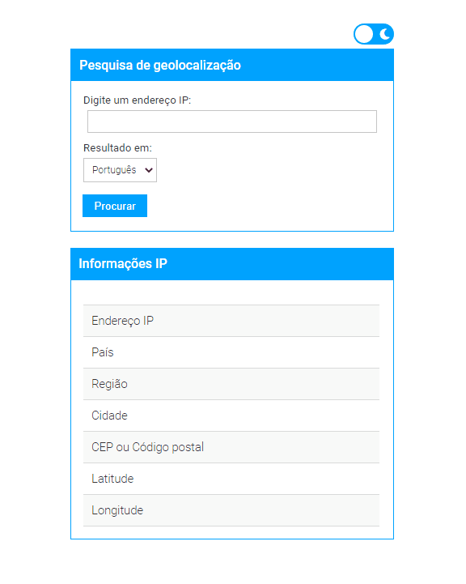

# ip-geolocation
### **IP-Geolocation** é uma aplicação que permite o usuário fazer consultas de **endereço IP** (com suporte para IPv4 e IPv6) e retorna informações como país, região/estado, cidade, CEP, latitude, longitude.

